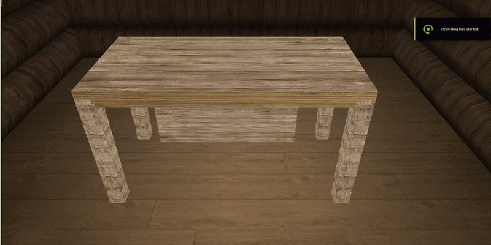

---

# Survivor Horror Game Engine - Projeto de Computação Gráfica

## 📌 Visão Geral

Este projeto consiste em uma prova de conceito (*Proof of Concept*) de um jogo de *Survival Horror* psicológico em primeira pessoa, ambientado em uma cabana proceduralmente gerada dentro de uma densa floresta. O motor gráfico foi desenvolvido em C++, utilizando OpenGL 2.1 como requisito para o projeto final da displina de Computação Gráfica

A arquitetura foi projetada para focar na atmosfera, gestão de luzes dinâmicas, física de partículas e interação ambiental, sem usar uma engine pronta, necessitando assim do uso extenso e preciso das ferramentas disponibilizadas pelo OpenGL trabalhadas durante a disciplina e exploradas a parte.

## 🎥 Demonstração


## ⚙️ Guia de Instalação

### Dependências do Sistema

O ambiente de desenvolvimento e execução baseia-se no ecossistema MSYS2 nativo para Windows.

| Ferramenta / Biblioteca | Propósito |
| --- | --- |
| **C++17 (g++)** | Compilação do código fonte via MSYS2 / UCRT64. |
| **CMake** | Sistema de automação de build (*Build System*). |
| **GLFW3** | Criação da janela de contexto e captura crua (*raw input*) de mouse e teclado. |
| **OpenGL32 & GLU32** | Bibliotecas core para renderização de gráficos 3D (Pipeline fixo 2.1). |
| **stb_image.h** | Decodificação nativa em C de texturas e imagens. |

### Compilação e Execução

1. Clone o repositório ou navegue até a raiz do projeto.
2. Abra o terminal **MSYS2 UCRT64** e certifique-se de estar no diretório do projeto Ex:`/c/Users/Projects/...`.
3. Execute os seguintes comandos para compilar o motor gráfico:

```bash
cmake --build build

```

4. Para iniciar a simulação, execute o binário recém-gerado:

```bash
./build/horror_engine.exe

```

---

### 🏗 Arquitetura e Funcionamento

O motor foi construído sob uma arquitetura modular, usando de matrizes lógicas e gerenciamento de memória. A implementação segue os seguintes passos fundamentais:

**1. O Núcleo do Motor e Gerenciamento de Tempo (Game Loop)**

* **Decisão de Projeto:** Migração da biblioteca legada GLUT para **GLFW**.
* **Implementação:** A arquitetura abandona o loop oculto `glutMainLoop()` em prol de um loop de execução explícito `while (!glfwWindowShouldClose(window))`. Dentro desse loop, calculamos ativamente o *Delta Time* (diferença de tempo entre quadros). Isso desacopla rigidamente a simulação da física (como a gravidade das partículas) da taxa de atualização do monitor, garantindo que o jogo rode na mesma velocidade em diferentes computadores.


**2. Máquina de Estados (State Machine)**

* **Decisão de Projeto:** Gerenciamento seguro de contexto para inputs do jogador.
* **Implementação:** O jogo é governado por um enum `GameState` com estados explícitos: `AWAKENING`, `EXPLORING`, `KEYPAD`, `COMBAT`, `COMPLETED` e `GAME_OVER`. O loop principal verifica esse estado antes de processar eventos. Por exemplo, no estado `KEYPAD`, as entradas do mouse são desativadas e as teclas de "W,A,S,D" param de influenciar a câmera, sendo redirecionadas para capturar números da tranca digital do baú. O estado `AWAKENING` ativa uma transição cinemática de câmera que sobe lentamente do chão.


**3. Grafo de Cena e Modelagem Hierárquica**

* **Decisão de Projeto:** Construção de objetos mecânicos complexos sem carregar arquivos 3D externos.
* **Implementação:** Utilizando a pilha de matrizes do OpenGL, o motor implementa uma estrutura de Grafo de Cena para modelagem hierárquica. Ao renderizar componentes complexos, cada objeto é tratado como um sistema de coordenadas locais. Isso assegura que transformações aplicadas a objetos-pai (como abrir a tampa de um baú) sejam automaticamente propagadas aos seus filhos, mantendo o alinhamento geométrico correto no world space.


**4. Sistema de Física e Colisão (AABB e Look-Ahead)**

* **Decisão de Projeto:** Impedir colisões irreais (ficar travado nas paredes) ou atravessar objetos sem usar um motor de física como Box2D/PhysX.
* **Implementação:** As colisões utilizam AABB (*Axis-Aligned Bounding Box*) resolvidas através do algorítmo matemático *Slab Method* (Raycasting vetorial saindo da câmera para interação com gavetas). O sistema de colisão do jogador implementa um design preditivo de "Look-Ahead": em vez de mover e colidir, calculamos o vetor do passo futuro e o verificamos separadamente nos eixos X e Z. Se houver obstáculo frontal (Z), mas a lateral (X) estiver livre, o jogador escorrega suavemente pela parede (*wall-sliding*).


**5. Sistema de Partículas e Integração de Euler**

* **Decisão de Projeto:** Detritos físicos com alto desempenho e sem *memory leaks* (vazamentos de memória).
* **Implementação:** Quando a escopeta dispara contra uma gaveta, ativamos o sistema de destruição. Para evitar alocação e destruição frequente na RAM (*malloc/free*), desenvolvemos um padrão de **Object Pool** — um array pré-alocado de 500 partículas. Durante o *Game Loop*, aplicamos a Integração de Euler (`v = v + g*dt`) em cada partícula ativa para simular a física gravitacional descendente até que expirem. O sistema utiliza da informação de textura do objeto para decidir a textura da partícula ativa.


**6. Inteligência Artificial (Pathfinding e Flocking)**

* **Decisão de Projeto:** Prevenir a "singularidade física" onde vários inimigos se fundem no exato mesmo ponto geométrico 3D.
* **Implementação:** Ao iniciar o estado `COMBAT`, cinco "entidades sombrias" são renderizadas. A "IA" aplicada usa uma função de funil, forçando todos a recalcular o alvo da perseguição para as coordenadas da porta frontal enquanto estiverem do lado de fora. Assim que atravessam, executam um algoritmo de **Flocking**: cada entidade itera sobre as outras quatro, calculando a distância vetorial. Se a distância for inferior a 0.8 metros, aplica-se uma força de repulsão local, fazendo a horda espalhar-se lateralmente para cercar o jogador ao redor da sala.


---

### 🎨 Elementos Gráficos

A construção estética da aplicação foi rigorosamente contida dentro das fronteiras do OpenGL 2.1, utilizando truques de renderização baseados em *Eye Space*, geometria procedural, e o pipeline de Função Fixa.

**1. Sombreamento de Gouraud e Subdivisão de Malha**

* **Decisão de Projeto:** Fazer a lanterna iluminar as superfícies no escuro.
* **Implementação:** Devido à limitação do OpenGL 2.1 (`GL_SMOOTH`), onde os cálculos de luz ocorrem única e exclusivamente nos vértices geométricos (interpolando a cor entre eles), construir uma sala com quads gigantescos fazia o facho de luz desaparecer. A solução implementada foi a geração matemática de paredes e pisos subdivididos (grids a cada 0.5m). Ao iluminar a sala, o feixe agora atinge vértices localizados, calculando o ponto de atenuação correto da luz.


**2. Iluminação Dinâmica em Hardware**

* **Decisão de Projeto:** Simular múltiplas fontes de luz respeitando o limite da VRAM.
* **Implementação:** O hardware emula um máximo de 8 luzes silmutâneas (`GL_LIGHT0` a `GL_LIGHT7`). A `GL_LIGHT0` funciona como a lanterna tática em primeira pessoa: chamamos sua posição dentro do "Eye Space" (antes de aplicar a matriz `gluLookAt` da câmera), passando os parâmetros vetoriais `GL_SPOT_DIRECTION` e definindo o ângulo de corte (`GL_SPOT_CUTOFF`). As luzes restantes operam como `Point Lights` nos cômodos com uma equação de atenuação quadrática aplicada, garantindo que suas intensidades se deteriorem antes de vazar pelas paredes.


**3. Pipeline de Texturas (Padrão Flyweight)**

* **Decisão de Projeto:** Integrar texturas reais para materiais e texturas para os destroços destruídos no tiroteio.
* **Implementação:** Integração via biblioteca `stb_image.h`. Implementamos uma classe modular `TextureManager` baseada no padrão de arquitetura *Flyweight*: utilizando a estrutura `std::map<std::string, GLuint>`, a textura da parede ou da madeira é carregada do disco para a GPU apenas uma vez e devolvida como um *Handle ID* instantâneo para todas as instâncias em cena. As texturas são projetadas utilizando coordenadas UV matemáticas ajustadas para o limite `GL_REPEAT` (impedindo que a parede estique o *wallpaper*). As partículas do sistema de detritos recebem programaticamente a mesma UV e `GLuint` do objeto originário.


**4. O Truque Z-Buffer para Interface de Inspeção (Eye Space Rendering)**

* **Decisão de Projeto:** Permitir ler cartas ou renderizar a arma na visão em 1ª pessoa sem que atravessem as paredes.
* **Implementação:** Para as interfaces 3D, utilizamos a manipulação agressiva do Z-Buffer. Quando o jogador aperta 'E' para ler uma carta, o motor primeiro renderiza a sala inteira normalmente. Imediatamente depois, executa `glClear(GL_DEPTH_BUFFER_BIT)`, forçando o chip gráfico a "esquecer" que há uma parede ali na frente. A câmera é restaurada para a posição original via `glLoadIdentity()` e o modelo tridimensional da carta (iluminado pela lanterna tática) é plotado no espaço exato da lente.


**5. Arquitetura Procedural (Cabana e Floresta Instanciada)**

* **Decisão de Projeto:** Criar um exterior rico sem carregar *meshes* de modeladores 3D (*.obj*, *.fbx*).
* **Implementação:**
* **Cabana:** As paredes foram desenvolvidas programaticamente transformando troncos de toras (*cilindros octogonais* criados via loop com raio de 10cm) alinhados em pilhas com janelas translúcidas (`GL_BLEND`) inseridas na malha.
* **Terreno e Árvores:** O terreno exterior adota deformações usando ondas senoidais, criando relevos de grama que possuem um "blend zone" matemático de 5 metros para transição com a estrada de terra. Toda a floresta foi gerada utilizando um padrão *Grid-Aligned* (assentado sobre grids perfeitos de 40x40m e espalhado em *tiles* de 20x20m), onde galhos matematicamente calculados ligam-se ao tronco local da árvore e se instanciam inúmeras vezes, mitigando os *draw calls* de geometria da GPU.
* **Skydome:** Uma abóbada esférica perfeitamente calculada com raios espaciais de 50 metros circunda a ilha do jogo, bloqueando as bordas finais do terreno.


**6. Curvas de Bézier (Avaliadores de Hardware)**

* **Decisão de Projeto:** Uso obrigatório de curvas paramétricas na disciplina.
* **Implementação:** Implementou-se um "Sigilo Amaldiçoado" (*Cursed Sigil*) desenhando vetorialmente sobre a carta ao inspecioná-la. Para evitar cálculos densos quadro a quadro na CPU, delegou-se o caminho para o Avaliador de Hardware nativo (`GL_MAP1_VERTEX_3`). Um array de pontos de controle interpolou a atração magnética das posições tridimensionais, e a curva completa foi traçada perfeitamente conectada a um Timer de renderização utilizando funções `glMap1f` e `glEvalCoord1f`.



## 📚 Atividades Práticas (Requisitos da Disciplina)

* **Ambiente Simulado e Controle FPS:** Movimentação fluída calculando os vetores de *Forward* e *Right* da câmera submetidos ao sistema `gluLookAt`, integrando o *raw-mouse capture* (`GLFW_CURSOR_DISABLED`).
* **Interação e Hierarquia de Matrizes:** Interação com gavetas e baús trancados (teclado numérico renderizado via projeção ortográfica), utilizando o histórico de pilha de modelagem para mover componentes independentes geometricamente atrelados.
* **Animações via Curvas Matemáticas:** Cumprindo a restrição avaliativa do uso de curvas, foi desenvolvido um Símbolo ("Cursed Sigil") onde pontos de controle Bézier geram malhas procedurais no momento da execução utilizando as funções nativas de hardware `glMap1f` e `glEvalCoord1f`.
* **Destruição Física de Cenário:** Um robusto sistema *Object Pool* lida com fragmentos e detritos baseados em **Integração de Euler** (`v = v + g*dt`). As partículas impactadas herdam programaticamente o *bind* de textura e coordenadas UV da geometria originária para total fidelidade de material.

## 🐛 Desafios Técnicos Resolvidos

1. **Inversão do Eixo-Y no Modo Ortográfico:** A renderização final do texto "VICTORY / YOU DIED" via `GL_LINES` apresentou-se rotacionada inversamente (cabeça para baixo) devido ao mapeamento padrão em `glOrtho`. Foi resolvido através da aplicação consciente de escalonamento paramétrico negativo (`glScalef(25.0f, -25.0f, 1.0f)`) para endireitar matematicamente as coordenadas sem alterar todo o conjunto de vértices.
2. **Exploit de Singuralidade Física e Dano Instântaneo:** Os monstros perseguiam a mesma coordenada global e se fundiam perfeitamente (0.0f de desvio), resultando em ataques combinados na taxa de 200 de dano, causando morte instantânea. Desenvolvi um algoritmo matemático de repulsão (*Flocking Behavior*) forçando-os a assumir distâncias interpessoais e atacar circundando o jogador.
3. **Escudos Invisíveis (Absorção de AABB):** O *Bounding Box* massivo do baú de madeira protegia a escopeta interna do `Raycast` do jogador, impedindo sua coleta. A solução adotada foi um sistema de condicional dinâmico onde o AABB defensivo das caixas trancadas colapsa perfeitamente assim que o objeto pai transita para o status destrancado.

## 🚀 Otimizações e Melhorias Futuras

* **Otimização por VBOs e Instanciamento:** Atualmente o terreno de 40x40m, as árvores e cabana integram polígonos usando o *Immediate Mode* (`glBegin` / `glEnd`). A melhoria definitiva seria processar blocos via Buffer Objects (`glGenBuffers`), enviando vértices em lote (batching) diretamente para a VRAM.
* **Sistema de Texture Atlas para Fontes:** Substituir as linhas custosas do `GL_LINES` usadas para desenhar palavras por recortes vetoriais dinâmicos de uma *Sprite Sheet* (Atlas Textural) mapeada via UV, viabilizando notas ricas na geração de textos e puzzles mais densos.
* **Frustum Culling Espacial:** Ignorar matematicamente chamadas de desenho (*draw calls*) da floresta densa quando a projeção da visão da câmera estiver limitada pelas paredes e porta da sala interior.

## 👏 Créditos

* **Biblioteca stb_image:** Biblioteca localizada no pacote stb produzida por Sean Barret (nothings), ferramenta excelente para manipulação de imagens, em especial para auxiliar no carregamento de imagens como texturas.

* **polyhaven.com:** Ferramenta de divulgação para assets 3d, usada para adquirir as texturas para terra, chão da cabana, grama, paredes e árvores.

* **magnific.com:** Usado para adquirir a imagem para o céu estrelado.